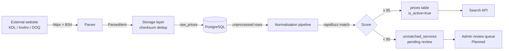
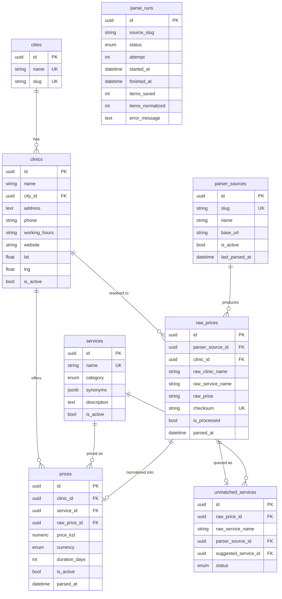

# MedServicePrice

[](https://python.org)
[](https://fastapi.tiangolo.com)
[](https://react.dev)
[](https://typescriptlang.org)
[](https://postgresql.org)
[](https://docker.com)
[](LICENSE)

A medical service price aggregator for Kazakhstan. Automatically collects prices from public clinic websites, normalises medical service names against a curated canonical dictionary, stores historical data, and provides a fast search interface for comparing clinics side-by-side.

> **Target cities:** Алматы · Астана · Шымкент  
> **Active sources:** KDL Olymp · ИНВИТРО · DOQ.kz

---

## Table of Contents

- [Features](#features)
- [Architecture overview](#architecture-overview)
- [Tech stack](#tech-stack)
- [Project structure](#project-structure)
- [Database schema](#database-schema)
- [Installation](#installation)
- [Environment variables](#environment-variables)
- [Running with Docker](#running-with-docker)
- [Running locally](#running-locally)
- [Database migrations](#database-migrations)
- [Seed data](#seed-data)
- [Parser architecture](#parser-architecture)
- [API overview](#api-overview)
- [Development workflow](#development-workflow)
- [Testing](#testing)
- [Code style](#code-style)
- [Screenshots](#screenshots)
- [Future improvements](#future-improvements)
- [License](#license)

---

## Features

| Feature | Status |
|---|---|
| Automated nightly price collection from 3 sources | ✅ Implemented |
| Fuzzy service-name normalisation (rapidfuzz) | ✅ Implemented |
| Full-text service search with city / category / price filters | ✅ Implemented |
| Side-by-side clinic comparison table (up to 4 clinics) | ✅ Implemented |
| Interactive map view (Leaflet / OpenStreetMap) | ✅ Implemented |
| Clinic detail page with full price list | ✅ Implemented |
| Price freshness indicators (30-day staleness window) | ✅ Implemented |
| Admin-protected scheduler API (manual trigger + run history) | ✅ Implemented |
| Parse run audit trail with retry logic (3 attempts) | ✅ Implemented |
| Duplicate deduplication via SHA-256 checksum | ✅ Implemented |
| Unmatched service review queue | ✅ Implemented |
| Admin UI for merging/reviewing unmatched services | 🗓 Planned |
| Authentication for end users | 🗓 Planned |
| Additional cities and sources | 🗓 Planned |

---

## Architecture overview

```
┌─────────────────────────────────────────────────────────────────┐
│                         Docker Compose                          │
│                                                                 │
│  ┌──────────────┐   nginx /api   ┌─────────────────────────┐   │
│  │   Frontend   │◄──proxy──────►│        Backend          │   │
│  │  React + Vite│               │       FastAPI            │   │
│  │  (Nginx:80)  │               │      (uvicorn:8000)      │   │
│  └──────────────┘               │                         │   │
│                                 │  ┌───────────────────┐  │   │
│                                 │  │    APScheduler    │  │   │
│                                 │  │  (in-process)     │  │   │
│                                 │  │  02:00 KDL        │  │   │
│                                 │  │  03:00 Invitro    │  │   │
│                                 │  │  04:00 DOQ        │  │   │
│                                 │  └─────────┬─────────┘  │   │
│                                 └────────────┼────────────┘   │
│                                              │                 │
│                                 ┌────────────▼────────────┐   │
│                                 │       PostgreSQL 16      │   │
│                                 │       (port 5432)        │   │
│                                 └─────────────────────────┘   │
└─────────────────────────────────────────────────────────────────┘
```

### Data pipeline



---

## Tech stack

### Backend

| Layer | Technology |
|---|---|
| API framework | FastAPI 0.115 |
| ORM | SQLAlchemy 2.0 (async) |
| Database driver | asyncpg |
| Database | PostgreSQL 16 |
| Migrations | Alembic |
| HTTP client (parsers) | httpx |
| HTML parsing | BeautifulSoup4 |
| Name matching | rapidfuzz |
| Scheduler | APScheduler 3 (AsyncIOScheduler) |
| Config | pydantic-settings |
| Runtime | Python 3.11, uvicorn |

### Frontend

| Layer | Technology |
|---|---|
| Framework | React 19 |
| Language | TypeScript 6 |
| Build tool | Vite 8 |
| Data fetching | TanStack Query v5 |
| HTTP client | axios |
| Routing | React Router v7 |
| Styling | Tailwind CSS v4 |
| Component library | shadcn/ui + Radix primitives |
| Map | React-Leaflet + OpenStreetMap |

### Infrastructure

| Component | Technology |
|---|---|
| Containerisation | Docker + Docker Compose |
| Production web server | Nginx 1.27 (Alpine) |
| Static asset caching | 1-year immutable headers |

---

## Project structure

```
medserviceprice/
├── backend/
│   ├── app/
│   │   ├── api/v1/          # Router registration and versioning
│   │   ├── core/            # Config, exceptions, logging
│   │   ├── db/              # Engine, declarative base, timestamp mixin
│   │   ├── dependencies/    # FastAPI DI: session, services, auth
│   │   ├── models/          # SQLAlchemy ORM models
│   │   ├── normalization/   # Text normalisation, fuzzy matcher, pipeline
│   │   ├── parsers/         # BaseParser, HttpClient, per-source implementations
│   │   │   └── sources/     # kdl.py · invitro.py · doq.py
│   │   ├── repositories/    # Database access layer (one class per model)
│   │   ├── routers/         # FastAPI route handlers
│   │   ├── scheduler/       # APScheduler setup and job orchestration
│   │   ├── schemas/         # Pydantic request/response models
│   │   └── services/        # Business logic layer
│   ├── alembic/
│   │   └── versions/        # Migration files (linear history)
│   ├── scripts/
│   │   ├── seed.py          # Reference data (cities, parser sources, KDL/Invitro clinics)
│   │   └── enrich_clinic_locations.py   # Populate lat/lng from DOQ API
│   ├── tests/
│   │   ├── unit/
│   │   └── integration/
│   ├── Dockerfile
│   ├── alembic.ini
│   └── pyproject.toml
│
├── frontend/
│   ├── src/
│   │   ├── api/             # Typed API functions + axios client + query keys
│   │   ├── components/
│   │   │   ├── common/      # Shared UI atoms (PriceTag, DataFreshness, …)
│   │   │   ├── layout/      # Header, Footer, RootLayout
│   │   │   └── ui/          # shadcn/ui primitives
│   │   ├── features/
│   │   │   ├── clinic/      # Clinic detail hooks and components
│   │   │   ├── comparison/  # ComparisonContext + CompareButton + ComparisonBar
│   │   │   └── search/      # SearchBar, FilterPanel, ResultsList, MapView, hooks
│   │   ├── hooks/           # useCities, useDebounce, useLocalStorage
│   │   ├── lib/             # config, constants, formatters, utils
│   │   ├── pages/           # HomePage, SearchPage, ClinicPage, ComparePage, NotFoundPage
│   │   ├── providers/       # QueryProvider, AppProviders
│   │   ├── router/          # createBrowserRouter definition
│   │   └── types/           # api.ts (raw API shapes) · domain.ts (app types)
│   ├── Dockerfile
│   ├── nginx.conf
│   └── package.json
│
├── docker-compose.yml       # Production
├── docker-compose.dev.yml   # Development (hot-reload)
└── README.md
```

---

## Database schema



### Key design decisions

- **`raw_prices.checksum`** — SHA-256 of `(source_slug, clinic_name, service_name, price)`. The `ON CONFLICT DO NOTHING` on this column is the sole deduplication guard; no `SELECT` before `INSERT` required.
- **`prices.is_active`** — allows a soft-delete when a newer price is ingested for the same `(clinic, service)`, preserving historical data.
- **`services.synonyms`** (JSONB + GIN index) — stores alternative names for the same canonical service, used as additional exact-match keys in the normalisation pipeline.
- **`unmatched_services`** — a review queue for service names that scored below the fuzzy threshold (85). Carries a `suggested_service_id` for human review.

---

## Installation

### Prerequisites

| Tool | Minimum version |
|---|---|
| Docker + Docker Compose | 24 / 2.24 |
| Python | 3.11 (local dev only) |
| Node.js | 20 (local dev only) |

### Clone

```bash
git clone https://github.com/your-org/medserviceprice.git
cd medserviceprice
```

---

## Environment variables

Copy the example file and fill in the required values:

```bash
cp backend/.env.example backend/.env
```

| Variable | Required | Default | Description |
|---|---|---|---|
| `APP_NAME` | No | `MedServicePrice` | Application name shown in logs |
| `DEBUG` | No | `false` | Enable debug logging and OpenAPI docs |
| `ADMIN_API_KEY` | **Yes** | — | API key for protected scheduler endpoints (`X-Admin-Key` header) |
| `CORS_ORIGINS` | No | `["http://localhost:3000"]` | JSON array of allowed CORS origins |
| `POSTGRES_USER` | **Yes** | — | PostgreSQL username |
| `POSTGRES_PASSWORD` | **Yes** | — | PostgreSQL password |
| `POSTGRES_HOST` | No | `localhost` | PostgreSQL host (set to `db` in Docker) |
| `POSTGRES_PORT` | No | `5432` | PostgreSQL port |
| `POSTGRES_DB` | **Yes** | — | PostgreSQL database name |

Generate a secure admin key:

```bash
python -c "import secrets; print(secrets.token_hex(32))"
```

The `DATABASE_URL` is composed automatically from the `POSTGRES_*` parts — do not set it directly.

---

## Running with Docker

### Production

Builds optimised containers. The frontend is compiled into static assets and served by Nginx, which also proxies `/api/*` to the backend.

```bash
# 1. Build and start all services
docker compose up --build

# Frontend:  http://localhost
# API docs:  not exposed in production (DEBUG=false)
# Database:  localhost:5432
```

### Development

Mounts source code for hot-reload. The Vite dev server runs with HMR; the backend reloads on file changes via `--reload`.

```bash
docker compose -f docker-compose.dev.yml up

# Frontend (Vite HMR):  http://localhost:5173
# API + Swagger UI:      http://localhost:8000/docs
# Database:             localhost:5432
```

---

## Running locally

### Backend

```bash
cd backend

# Create and activate a virtual environment
python -m venv .venv
source .venv/bin/activate      # Windows: .venv\Scripts\activate

# Install the package in editable mode (includes all dependencies)
pip install -e ".[dev]"

# Ensure PostgreSQL is running, then run migrations
alembic upgrade head

# Seed reference data (cities, parser sources, KDL/Invitro clinics)
python -m scripts.seed

# Start the development server
uvicorn app.main:app --reload --port 8000
```

### Frontend

```bash
cd frontend
npm install
npm run dev
# Open http://localhost:5173
```

---

## Database migrations

Migrations are managed by Alembic and run automatically on container start. To manage them manually:

```bash
cd backend

# Apply all pending migrations
alembic upgrade head

# Check current revision
alembic current

# Generate a new migration from ORM changes
alembic revision --autogenerate -m "describe your change"

# Roll back one step
alembic downgrade -1

# Roll back to the initial revision
alembic downgrade base
```

> **Adding a new model:** import it in `app/models/__init__.py` so Alembic detects it during autogenerate.

---

## Seed data

The seed script is **idempotent** (safe to re-run). It inserts:
- 3 cities: Алматы, Астана, Шымкент
- 3 parser sources: `kdl`, `invitro`, `doq`
- Clinic records for KDL and ИНВИТРО (one per city)

DOQ clinic records are created automatically by the normalisation bootstrap step on the first parser run.

```bash
python -m scripts.seed
```

To populate clinic coordinates from the DOQ API (required for the map view):

```bash
python -m scripts.enrich_clinic_locations
```

---

## Parser architecture

### Design

All parsers extend a single abstract base class and produce a flat list of `ParsedItem` objects — a format-agnostic contract that decouples extraction from storage.

```
BaseParser (ABC)
    └── parse() → list[ParsedItem]

ParsedItem
    parser_source_slug, raw_clinic_name, raw_service_name,
    raw_price, raw_currency, raw_duration, source_url, parsed_at
```

### HTTP client

A shared `HttpClient` async context manager wraps `httpx.AsyncClient` with:
- Configurable per-request delay (politeness)
- Exponential backoff retry (default: 3 attempts, 0.5 s base delay)
- Shared connection pool across all requests in one run
- Consistent `User-Agent` header

### Source implementations

| Slug | Source | Method | Notes |
|---|---|---|---|
| `kdl` | kdlolymp.kz | JSON API | Paginated by `?page=N`; filters by `city_id` |
| `invitro` | invitro.kz | HTML scraping | Per-city catalog pages via BeautifulSoup |
| `doq` | api.doq.kz | JSON API | All doctor-services fetched; deduped to lowest price per `(branch, service)` |

### Running a parser manually

```bash
cd backend

# Dry-run (fetch only, print first 5 items, no DB writes)
python -m app.parsers.runner kdl --dry-run

# Full run (fetch → save to raw_prices → normalise)
python -m app.parsers.runner invitro

# Available slugs: kdl · invitro · doq
```

### Normalisation pipeline

```bash
# Normal run against existing canonical service dictionary
python -m app.normalization.runner --source kdl

# Bootstrap mode: creates canonical Service records from unique raw names,
# then runs normalisation. Safe to re-run (idempotent).
python -m app.normalization.runner --source kdl --bootstrap

# Adjust fuzzy threshold (default: 85)
python -m app.normalization.runner --source doq --threshold 80
```

**Matching priority:**

1. **Exact / synonym lookup** — O(1) dict lookup on `normalize_text()` of service name and all synonyms, with and without parenthetical suffixes stripped.
2. **Fuzzy match** — `rapidfuzz.fuzz.token_sort_ratio` over all canonical names. Scores ≥ 85 → `prices`. Scores 60–84 → `unmatched_services` with a `suggested_service_id`.
3. **Unmatched** — written to `unmatched_services.status = pending` for admin review.

### Scheduled runs

APScheduler runs nightly at Asia/Almaty time. Each job calls `parse → save → normalise` with up to 3 automatic retries (60 s, 120 s delay between attempts). Results are recorded in `parse_runs`.

| Source | Schedule |
|---|---|
| `kdl` | 02:00 |
| `invitro` | 03:00 |
| `doq` | 04:00 |

### Adding a new parser

1. Create `backend/app/parsers/sources/your_source.py` extending `BaseParser`.
2. Set `source_slug = "your_source"` (must match a `parser_sources.slug` row).
3. Implement `async def parse(self) -> list[ParsedItem]`.
4. Register the class in `app/scheduler/jobs.py` and `app/parsers/runner.py`.
5. Add a row to `scripts/seed.py` and re-run the seed script.

---

## API overview

Base path: `/api/v1`

Interactive documentation is available at `http://localhost:8000/docs` when `DEBUG=true`.

### Public endpoints

| Method | Path | Description |
|---|---|---|
| `GET` | `/health` | Liveness check + DB connectivity status |
| `GET` | `/cities` | List all cities |
| `GET` | `/clinics` | List clinics, optionally filtered by `city_slug` |
| `GET` | `/clinics/{id}` | Clinic detail |
| `GET` | `/clinics/{id}/services` | Active prices for a clinic |
| `GET` | `/services` | Search canonical services by name/synonym/category |
| `GET` | `/services/{id}` | Single service detail |
| `GET` | `/search` | **Main search endpoint** |

#### Search parameters

| Parameter | Type | Description |
|---|---|---|
| `query` | `string` (required, min 2 chars) | Service name or synonym |
| `city_slug` | `string` | e.g. `almaty` · `astana` · `shymkent` |
| `category` | `enum` | `lab` · `doctor_visit` · `diagnostics` · `procedure` |
| `min_price` | `decimal` | Minimum price in KZT |
| `max_price` | `decimal` | Maximum price in KZT |
| `limit` | `int` | 1–200, default 50 |

### Admin endpoints

Protected by `X-Admin-Key` header.

| Method | Path | Description |
|---|---|---|
| `GET` | `/scheduler/jobs` | List scheduled jobs and next run times |
| `POST` | `/scheduler/run/{slug}` | Manually trigger a parser run |
| `GET` | `/scheduler/runs` | Parse run history (filterable by source) |
| `GET` | `/scheduler/runs/{id}` | Single parse run detail |

```bash
# Example: trigger a manual parse
curl -X POST http://localhost:8000/api/v1/scheduler/run/kdl \
  -H "X-Admin-Key: your-admin-key"
```

---

## Development workflow

### Starting the dev environment

```bash
# Everything in one command (hot-reload on both frontend and backend)
docker compose -f docker-compose.dev.yml up
```

### Backend-only workflow

```bash
cd backend
source .venv/bin/activate
uvicorn app.main:app --reload --port 8000
```

### Running a full pipeline end-to-end (local)

```bash
cd backend

# 1. Apply migrations
alembic upgrade head

# 2. Seed reference data
python -m scripts.seed

# 3. Run a parser (dry-run first to verify)
python -m app.parsers.runner kdl --dry-run
python -m app.parsers.runner kdl

# 4. Normalise
python -m app.normalization.runner --source kdl --bootstrap

# 5. Populate clinic coordinates
python -m scripts.enrich_clinic_locations

# 6. Search via API
curl "http://localhost:8000/api/v1/search?query=глюкоза&city_slug=almaty"
```

### Frontend-only workflow

```bash
cd frontend
npm run dev
# Proxies /api requests to localhost:8000 automatically (vite.config.ts)
```

---

## Testing

The test scaffolding is in place; test coverage is a work in progress.

```bash
cd backend
pytest                          # Run all tests
pytest tests/unit/              # Unit tests only
pytest tests/integration/       # Integration tests only
pytest -v --tb=short            # Verbose output
```

> **Planned:** Parser fixture-based tests (saved sample API responses / HTML → assert `ParsedItem` output), matcher unit tests, and a pipeline integration test against a test database.

---

## Code style

### Backend

```bash
cd backend

# Lint and auto-fix
ruff check . --fix
ruff format .
```

Ruff is configured in `pyproject.toml` with rules `E`, `F`, `I` (isort), `UP` (pyupgrade), line length 100.

### Frontend

```bash
cd frontend

# Lint
npm run lint

# Format (Prettier)
npx prettier --write src/
```

Linting uses oxlint with the `react/rules-of-hooks` and `react/only-export-components` rules enabled.

---

## Screenshots

> Screenshots will be added once the application is deployed.

| Page | Description |
|---|---|
| **Search page** | Keyword + city filter, price range slider, category filter, sorted results list |
| **Map view** | Colour-coded markers per source (KDL blue / Invitro rose / DOQ emerald) with price popups |
| **Comparison table** | Side-by-side price grid with cheapest price highlighted in green |
| **Clinic detail** | Full service price table with data freshness indicators and source links |

---

## Future improvements

These are known limitations or planned extensions, not open bugs.

1. **Price supersession logic** — when a new price is parsed for an existing `(clinic, service)` pair, the old active price should be deactivated automatically to prevent stale prices appearing in search results.

2. **Full-text search** — replace `ILIKE '%query%'` with PostgreSQL `pg_trgm` or `to_tsvector` / `to_tsquery` for index-backed, typo-tolerant search at scale.

3. **Admin UI for unmatched services** — a review interface to accept/reject/merge the suggestions in `unmatched_services`, and to add synonyms to canonical services.

4. **Dedicated task queue** — move parser jobs out of the web process into ARQ or Celery so long-running scrapes don't compete with API request handling, and to support multi-replica deployments safely.

5. **Metrics and observability** — Prometheus metrics endpoint, structured JSON logging, and Sentry error reporting.

6. **Playwright-based parsers** — support for JavaScript-rendered clinic websites that cannot be scraped with simple HTTP + BeautifulSoup.

7. **More sources and cities** — Медлайн, Олимп, city expansion beyond the current three.

8. **Pagination on list endpoints** — all list endpoints currently return bare arrays; wrapping in `{ total, limit, offset, items }` will enable frontend pagination.

9. **Rate limiting** — per-IP rate limiting on the public search API before launch.

10. **CI/CD pipeline** — GitHub Actions: lint → test → build Docker images → push to registry.

---

## License

This project is licensed under the [MIT License](LICENSE).
